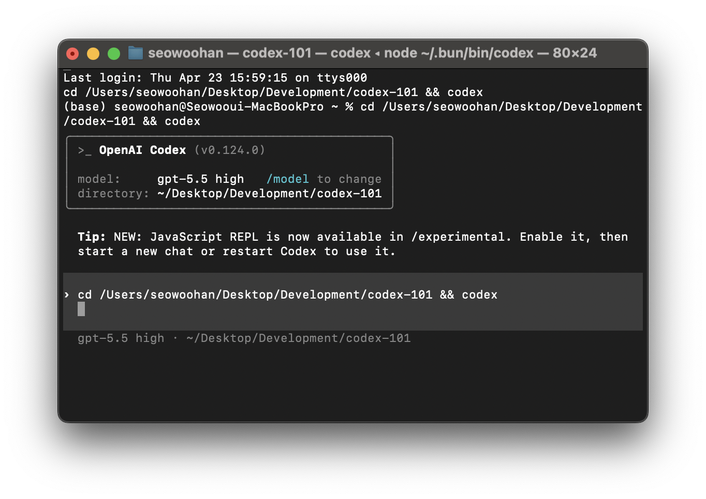

<p align="center">
  
</p>

<h1 align="center">Codex 101 — OpenAI Codex 완벽 가이드</h1>

<p align="center">
  <strong>The definitive bilingual (🇰🇷 KR / 🇺🇸 EN) guide to OpenAI Codex</strong><br/>
  CLI · macOS App · IDE Extension · Web Dashboard
</p>

<p align="center">
  <a href="https://swhan0329.github.io/codex-101/">🌐 Live Site</a> ·
  <a href="#contributing">🤝 Contributing</a> ·
  <a href="#disclaimer">⚠️ Disclaimer</a>
</p>

---

## 📖 What is this?

**Codex 101**은 OpenAI의 에이전틱 코딩 플랫폼 **Codex**를 처음부터 끝까지 다루는 가이드입니다.

[OpenAI 공식 문서](https://developers.openai.com/codex/)를 기반으로, AI를 활용하여 정보를 정리하고 실전 팁과 함께 하나의 페이지로 구성했습니다.

### 다루는 내용

| 섹션 | 주제 |
|------|------|
| 01–03 | 에코시스템 개요, 제품군, 지원 모델 |
| 04–05 | 시스템 요구사항 & 가격, 설치 및 인증 |
| 06–09 | CLI, App, IDE Extension, Web 사용법 |
| 10–14 | 승인 모드, 슬래시 명령어, AGENTS.md, config.toml, MCP |
| 15–16 | 세션 관리, CI/CD 자동화 |
| 17 | 프롬프트 엔지니어링 팁 (@reach_vb 기반) |
| 18–19 | 고급 활용, Codex vs Cursor vs Claude Code 비교 |
| 20–21 | FAQ, 참고 자료 |

---

## 🌍 Languages

현재 **한국어 🇰🇷** 와 **영어 🇺🇸** 를 지원합니다.  
페이지 우측 상단의 🌐 버튼으로 실시간 전환 가능합니다.

> 다른 언어 번역 기여를 환영합니다! `i18n.js`에 새 언어 블록을 추가해 주세요.

---

## ⚠️ Disclaimer

> 이 가이드는 **OpenAI 공식 문서**와 커뮤니티 정보를 기반으로 AI를 활용하여 초안을 작성한 뒤, **직접 검수를 거쳐** 최종 배포한 것입니다.  
> 그럼에도 검수 과정에서 미처 발견하지 못한 **오타, 오역, 부정확한 정보**가 남아있을 수 있습니다.  
>  
> 잘못된 부분을 발견하시거나 의문이 있다면 **Issue** 또는 **PR**로 알려주세요!  
> Codex는 빠르게 업데이트되고 있으므로, 최신 정보는 항상 [공식 문서](https://developers.openai.com/codex/)를 확인해 주세요.

---

## 🤝 Contributing

오픈소스 기여를 환영합니다! 🎉

### 기여할 수 있는 것들

- 🐛 **오류 수정** — 잘못된 정보, 오타, 오역 발견 시 PR
- 🌐 **번역 추가** — 새로운 언어 지원 (`i18n.js`에 추가)
- 💡 **실전 팁** — 유용한 Codex 사용 팁이나 워크플로 공유
- 📸 **스크린샷** — 최신 UI 스크린샷 업데이트
- 📝 **내용 보강** — 부족한 섹션 보완, 새로운 기능 추가

### How to Contribute

```bash
# 1. Fork & Clone
git clone https://github.com/<your-username>/codex-101.git
cd codex-101

# 2. 브라우저에서 index.html 열어서 변경 확인
open index.html

# 3. 변경 후 PR 제출
git checkout -b fix/my-improvement
git commit -m "Fix: 잘못된 정보 수정"
git push origin fix/my-improvement
```

---

## 🏗️ Project Structure

```
codex-101/
├── index.html   # 메인 페이지 (21개 섹션)
├── style.css    # 스타일 (다크/라이트 테마)
├── app.js       # 인터랙션 (TOC, 모델 토글, 테마 등)
├── i18n.js      # 다국어 번역 (KR/EN)
└── images/      # 스크린샷
```

---

## 📝 License

This project is open source and available under the [MIT License](LICENSE).

---

<p align="center">
  Made with ❤️ by <a href="https://github.com/swhan0329">@swhan0329</a><br/>
  Built with the help of AI — PRs welcome!
</p>
