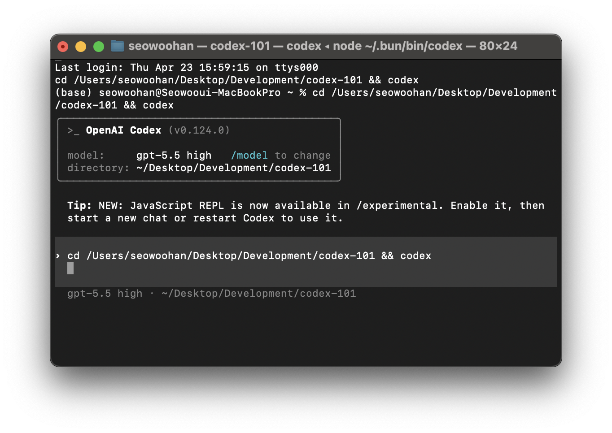

<p align="center">
  
</p>

<h1 align="center">Codex 101 — OpenAI Codex Guide</h1>

<p align="center">
  <strong>A bilingual guide to using OpenAI Codex in real projects</strong><br/>
  CLI · Desktop App · IDE Extension · Web/Mobile
</p>

<p align="center">
  <strong>Last updated: August 9, 2026</strong><br/>
  <a href="https://swhan0329.github.io/codex-101/">Live Site</a> ·
  <a href="README_KO.md">Korean README</a>
</p>

---

## About

**Codex 101** is a practical, bilingual guide for people learning or rolling out OpenAI Codex. It covers the main Codex surfaces, setup decisions, safety controls, configuration, MCP, workflow automation, and prompt patterns.

The guide is written from the official OpenAI Codex documentation first, then manually reviewed before publishing. Because Codex changes quickly, treat the live guide as a learning companion and always confirm critical model, pricing, security, and availability details in the [official docs](https://developers.openai.com/codex/).

## Start Here

- **First-time users**: read sections `04-06` for setup and first run, then `10` for sandbox/approval basics, and `14` for OpenAI Docs MCP.
- **Professional users**: read sections `12-14` for `AGENTS.md`, `config.toml`, and MCP, then `15-17` for sessions, automation, and prompt contracts.
- **Example-driven readers**: open the live site and the use-case gallery to start from real workflows instead of feature lists.

## August 9, 2026 Refresh Notes

- Rechecked `developers.openai.com/codex/models` first. Recommended Codex models remain the GPT-5.6 family: `gpt-5.6-sol`, `gpt-5.6-terra`, and `gpt-5.6-luna`; `gpt-5.5` remains previous-generation, `gpt-5.2` / `gpt-5.3-codex` remain deprecated for ChatGPT-authenticated Codex, and `gpt-5.4` / `gpt-5.4-mini` now have an August 31, 2026 ChatGPT sign-in Codex retirement notice.
- Tightened the Max/Ultra note from the current model and subagents docs: Max gives one selected model more reasoning time for a single hard task, while Ultra uses subagents for divisible work and may require enabling **Ultra in model picker slider** under Settings > Configuration.
- Rechecked pricing, Speed/Fast mode, remote connections, app/features, app/automations, config, MCP, hooks, plugins, skills, Sites, OpenAI API latest-model/changelog, and current Platform/API surfaces. Fast mode still includes GPT-5.6, GPT-5.5, and GPT-5.4 while GPT-5.4 is available; GPT-5.6/GPT-5.5 use 2.5x Standard credits, GPT-5.4 uses 2x, and API-key workflows stay on API token pricing. Saved ChatGPT-authenticated Codex configs should replace `gpt-5.4` with `gpt-5.6-terra` and `gpt-5.4-mini` with `gpt-5.6-luna` before August 31, 2026.
- Rechecked What's new and the current Codex changelog. CLI 0.147.0 adds cached MCP tool exposure before server startup, model-owned token budget defaults, enterprise automation account plan support, stricter current-turn permission/profile handling, MCP 2026 client/discovery support, Agent Plugin runtime-boundary work, remote plugin search, portable Agent Plugins, and broader app-server/thread/history refinements. The previous 0.146.0 named chats, pinned threads, temporary forks, standalone web search, executor-provided skills, Agent Plugin manifests, workspace plugin publishing, and app-server/WebSocket improvements remain reflected.
- Rechecked the official use-case catalog. It still has 101 local detail pages and all 101 local `official.promptEn` values match the official `starterPrompt.body` exactly; the first card's canonical detail slug remains `daily-work-brief`, with `proactive-teammate` retained as a local hash alias.
- Added the July 23 ChatGPT desktop app 26.715 update: ChatGPT Voice can coordinate Chat, Work, and Codex tasks in the desktop app and through Remote on iOS; local projects can include multiple folders with one primary folder for Git, new chats, AGENTS.md, skills, and `config.toml`.
- Reflected OpenAI API GPT-5.6 guidance separately from Codex product guidance: `gpt-5.6` routes to `gpt-5.6-sol`; GPT-5.6 adds Programmatic Tool Calling, Multi-agent beta, explicit prompt caching, persisted reasoning, max reasoning effort, Pro mode, and original/auto image detail preservation. API hard spend limits and the July 29 Terraform provider remain Platform/API lane items. The July 30 price-performance post lowers GPT-5.6 Luna API pricing by 80% and Terra by 20%, says those lower Luna/Terra costs are reflected in Codex and ChatGPT Work usage counting, and introduces API Fast mode for Sol at up to 2.5x faster Standard speed at twice the price. The July 30 ARC-AGI-3 post reinforces the Platform/API lane: use Responses API, retained reasoning, and compaction for long agent runs. The August 3 GPT-Live engineering post is recorded as Voice/API architecture context: full-duplex voice, asynchronous delegation to frontier models, and agent/computer coordination in the desktop app, not a separate Codex setup flag. The August 6 ChatGPT GPT-5.6 Sol update is also separated: it improves ChatGPT Chat and expands Free/Go access to Luna, but the announcement says the Work/Codex Sol version is not changing in that release.
- Re-audited the official use-case catalog: official individual pages 101 after excluding collection pages, local cards 101, `promptEn` gaps 0, `promptKo` gaps 0, official Starter prompt mismatches 0, line/token structure regressions 0, and no new or changed Starter prompts.
- Rechecked Remote connections against current official docs. iOS/Android can control awake/online macOS or Windows hosts, and supported Mac or Windows desktop apps can continue work on another host from Settings > Connections > Control other devices. Host files, credentials, permissions, plugins, browser setup, Computer Use, and local tools remain on the connected host.
- Rechecked openai.com/index and OpenAI Developers/API docs. No Codex product model recommendation change was needed. The August 7 cybersecurity capabilities post is recorded as security/preparedness context for high-capability agentic systems, not as a Codex setup flag or model-picker change. The August 6 GPT-5.6 Sol ChatGPT announcement remains ChatGPT model-access context only because it explicitly leaves the Work/Codex Sol variant unchanged.
- Person-level practitioner signals were rechecked in Chrome against X, LinkedIn, and Threads. No new person-level Codex workflow post was promoted today; the existing Section 20 practitioner cards remain unchanged and continue to link to original posts or official corroborating docs.

## June 12, 2026 Refresh Notes

- Reflected the June 11 Codex app 26.609 release: rate-limit reset banking, Developer mode for Browser/CDP work, `/init` in the app composer, expanded Enterprise Computer Use, and Windows Computer Use per-app access controls.
- Rechecked pricing, quickstart, config/profile, app settings/features, remote connections, Sites, Bedrock, MCP, hooks, plugins, and skills through the fresh Codex manual. No model-order, remote-control, or Sites setup reversal was needed, but Quickstart now clearly foregrounds the standalone installers.
- Audited all 101 official Codex use cases after excluding collection pages. The catalog count, local/official IDs, `promptEn`, `promptKo`, and multiline Korean prompt shape are clean.
- Rechecked OpenAI launch/customer-story surfaces. The June 11 Ona acquisition announcement is captured only as pre-closing enterprise execution direction, not as an enabled feature, model, plan, platform, preview/GA, or feature-flag change.
- Person-linked practitioner tips stay separate from product documentation. The public guide points readers to original posts or official corroborating docs, and only verified, reader-useful guidance is promoted.

## What's Covered

| Section | Topic |
| --- | --- |
| Start Here | Quick paths for beginners and teams |
| 01-03 | Codex ecosystem, product surfaces, supported models |
| 04-05 | Requirements, pricing, installation, authentication |
| 06-09 | CLI, Desktop App, IDE Extension, Web/Mobile |
| 10-14 | Approvals, sandboxing, slash commands, `AGENTS.md`, `config.toml`, MCP |
| 15-17 | Session strategy, automation, prompt contracts |
| 18-21 | Advanced usage, FAQ, references, practitioner tips |

## Languages

The site currently supports Korean and English. Use the language toggle in the top-right corner of the live page, or update the translation blocks in `i18n.js` when contributing.

## Local Preview

This is a static site. No build step is required for basic review.

```bash
open index.html
open use-cases.html
```

## Project Structure

```text
codex-101/
├── index.html          # Main Codex 101 guide
├── use-cases.html      # Use-case gallery
├── app.js              # Theme, language, navigation, interactions
├── i18n.js             # Korean/English translation content
├── use-cases-data.js   # Use-case gallery data
├── style.css           # Responsive styling
└── images/             # Screenshots and explainer visuals
```

## Contributing

Contributions are welcome for corrections, translations, screenshots, examples, and workflow tips.

```bash
git clone https://github.com/<your-username>/codex-101.git
cd codex-101
open index.html
```

After reviewing your change locally, open a pull request with a short explanation of what changed and which page or section you checked.

## License

This project is released under the MIT License.

---

<p align="center">
  Made by <a href="https://github.com/swhan0329">@swhan0329</a><br/>
  Built with the help of AI. Pull requests are welcome.
</p>
