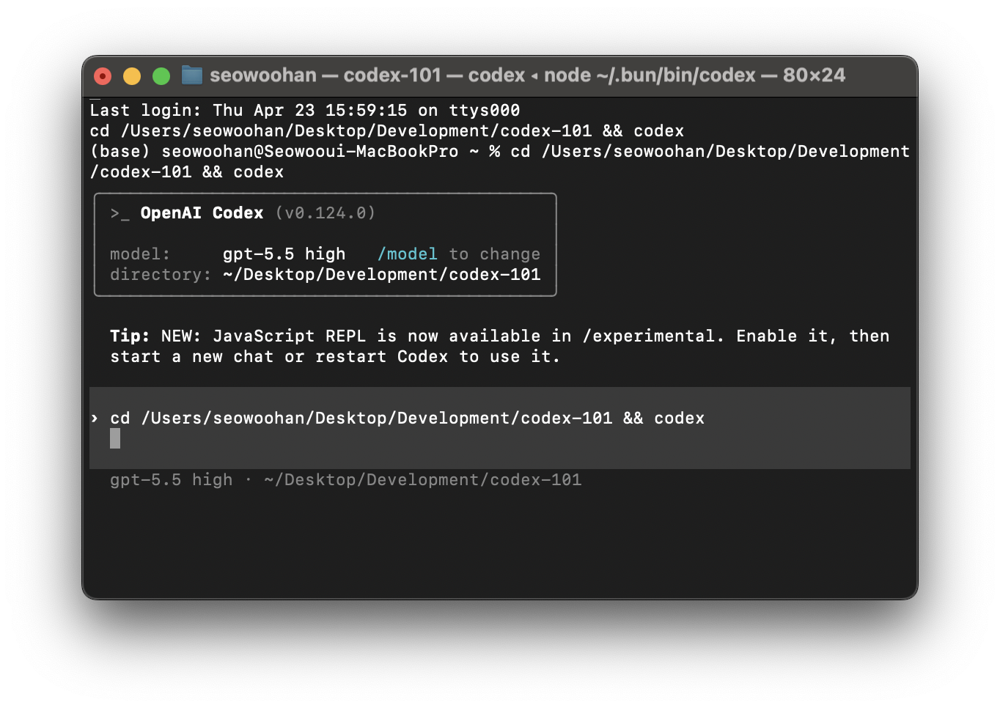

<p align="center">
  
</p>

<h1 align="center">Codex 101 — OpenAI Codex 완벽 가이드</h1>

<p align="center">
  <strong>다국어(🇰🇷 한국어 / 🇺🇸 English) OpenAI Codex 종합 가이드</strong><br/>
  CLI · Desktop App (macOS/Windows) · IDE Extension · Web Dashboard
</p>

<p align="center">
  <strong>최종 업데이트: 2026년 4월 3일</strong><br/>
  라이브 사이트는 보는 사람의 당일 날짜를 자동으로 표시하며, 최신 Codex 모델 가이드를 공식 문서 기준으로 반영합니다.
</p>

<p align="center">
  <a href="https://swhan0329.github.io/codex-101/">🌐 라이브 사이트</a> ·
  <a href="README.md">🇺🇸 English</a>
</p>

---

## 📖 소개

**Codex 101**은 OpenAI의 코딩 에이전트 **Codex**를 처음 사용하는 사용자와 실무 사용자 모두를 위해 다시 정리한 가이드입니다.

[OpenAI 공식 문서](https://developers.openai.com/codex/)와 OpenAI Docs MCP 조회 결과를 바탕으로 정리하고, **직접 검수를 거쳐** 최종 배포했습니다.

### 사용자별 빠른 읽기 경로

- **처음 사용하는 사용자**: **04-06**(설치/로그인/첫 실행) → **10**(approval/sandbox 기초) → **14**(OpenAI Docs MCP) 순서로 읽는 것을 권장합니다.
- **실무 사용자**: **12-14**(AGENTS.md/config.toml/MCP) → **15-17**(세션 운영/자동화/프롬프트 실행 계약) 순서로 읽으면 팀 운영 기준을 빠르게 잡을 수 있습니다.

### 일일 MCP 검증 스냅샷 (2026-04-03)

- `codex/models`를 다시 대조한 결과, 추천 모델은 오늘도 `gpt-5.4`, `gpt-5.4-mini`, `gpt-5.3-codex`, `gpt-5.3-codex-spark`의 4개 축입니다. 대안 모델군도 `gpt-5.2-codex`, `gpt-5.2`, `gpt-5.1-codex-max`, `gpt-5.1`, `gpt-5.1-codex`, `gpt-5-codex`, `gpt-5-codex-mini`, `gpt-5`로 유지되고 있고, 공식 문구에서 여전히 `gpt-5.3-codex`의 코딩 역량이 GPT-5.4를 뒷받침한다고 설명합니다.
- `Introducing GPT-5.4`와 `Introducing GPT-5.4 mini and nano`를 함께 보면 모델 해석이 더 분명해집니다. Codex 표면에서 기본 선택지는 여전히 `gpt-5.4`와 `gpt-5.4-mini`이고, `nano`는 현재 Codex 모델 페이지의 추천/대안 목록에 없으므로 API 쪽 경량 보조 모델로 이해하는 편이 맞습니다.
- 가격/접근 범위는 이번에는 Quickstart, Pricing, 그리고 2026년 4월 2일 OpenAI 가격 발표를 함께 봐야 정확합니다. Quickstart는 이제 모든 ChatGPT 플랜에 Codex가 포함된다고 설명하고, 팀 관점에서는 Business·Enterprise에서 고정 seat fee 없이 쓰는 Codex-only pay-as-you-go 좌석과 최대 $500 크레딧 프로모션이 추가됐습니다. 가격 페이지도 팀 플랜을 토큰 기반 과금으로 옮기는 흐름을 보여주므로, 실무적으로는 개인 한도표와 팀 크레딧 구조를 분리해서 읽는 편이 정확합니다.
- 설치 흐름은 예전보다 더 분명해졌습니다. Quickstart는 앱을 가장 쉬운 시작 경로로 두고, IDE는 VS Code, Cursor, Windsurf, JetBrains를 함께 다루며, API 키 로그인도 가능하지만 cloud threads 같은 기능은 제한될 수 있다고 안내합니다.
- Windows 문서는 이제 일반 Windows 가이드와 전용 Windows App 문서가 역할을 나눕니다. 기본 권장은 네이티브 앱이고, Microsoft Store나 `winget`로 설치할 수 있으며, `elevated` 샌드박스를 우선 쓰고 `unelevated`는 대안으로 봅니다. 전용 데스크톱 격리가 기본이고, 워크플로가 Linux 중심이거나 IDE 에이전트 작업이 필요할 때 WSL이 적절한 선택지로 정리됩니다.
- 현재 app/app features 문서를 보면 Codex App은 단순한 데스크톱 셸이 아니라 worktrees, Automations, Git 도구, 내장 terminal, voice dictation, pop-out window, IDE sync, image input, notifications, 절전 방지까지 묶은 작업 허브로 설명됩니다.
- Plugins도 문서상 훨씬 명확해졌습니다. 공식 `Plugins` 페이지는 app의 plugin directory와 CLI의 `/plugins` 흐름을 분리해 설명하고, plugin을 skills·app integrations·MCP servers를 함께 묶는 배포 단위로 정의합니다.
- `config.toml` 최신화 포인트도 더 넓어졌습니다. 현재 reference는 `review_model`, top-level `web_search`, `tools.web_search`, `personality`, `service_tier`, `default_permissions`, `tools.view_image`, `windows.sandbox`, `windows.sandbox_private_desktop`, `model_instructions_file`, granular approval policy, app 권한 제어, feature flag, permissions profile까지 함께 다룹니다.

### 사용자별 즉시 적용 요약

- **처음 사용자 (10분)**: `04-06` 설치/로그인 → `10`에서 기본 sandbox/approval 유지 → 작은 수정 1건 + Git 체크포인트.
- **실무 사용자 (팀 롤아웃)**: `12-14`에서 AGENTS.md + `.codex/config.toml` 고정 → `15-16` 자동 실행/리뷰 흐름 표준화 → `17` 프롬프트 계약을 팀 기본값으로 채택.

### 다루는 내용

| 섹션 | 주제 |
|------|------|
| Start Here | 처음 사용자용 빠른 시작 경로와 실무 운영 경로 |
| 01–03 | 에코시스템 개요, 제품군, 지원 모델 |
| 04–05 | 시스템 요구사항 & 가격, 설치 및 인증 |
| 06–09 | CLI, App, IDE Extension, Web 사용법 |
| 10–14 | 승인 모드, 슬래시 명령어, AGENTS.md, config.toml, MCP |
| 15–16 | 세션 관리, CI/CD 자동화 |
| 17 | Prompting GPT-5.4 개요, 실행 계약, 워크플로, 플레이북 |
| 18–19 | 고급 활용, Codex vs Cursor vs Claude Code 비교 |
| 20–21 | FAQ, 참고 자료 |

---

## 🌍 지원 언어

현재 **한국어 🇰🇷** 와 **영어 🇺🇸** 를 지원합니다.  
페이지 우측 상단의 🌐 버튼으로 실시간 전환 가능합니다.

> 다른 언어 번역 기여를 환영합니다! `i18n.js`에 새 언어 블록을 추가해 주세요.

---

## ⚠️ 면책 사항

> 이 가이드는 **OpenAI 공식 문서**와 커뮤니티 정보를 기반으로 AI를 활용하여 초안을 작성한 뒤, **직접 검수를 거쳐** 최종 배포한 것입니다.  
> 그럼에도 검수 과정에서 미처 발견하지 못한 **오타, 오역, 부정확한 정보**가 남아있을 수 있습니다.  
>  
> 잘못된 부분을 발견하시거나 의문이 있다면 **Issue** 또는 **PR**로 알려주세요!  
> Codex는 빠르게 업데이트되고 있으므로, 최신 정보는 항상 [공식 문서](https://developers.openai.com/codex/)를 확인해 주세요.

---

## 🤝 기여하기

오픈소스 기여를 환영합니다! 🎉

### 기여할 수 있는 것들

- 🐛 **오류 수정** — 잘못된 정보, 오타, 오역 발견 시 PR
- 🌐 **번역 추가** — 새로운 언어 지원 (`i18n.js`에 추가)
- 💡 **실전 팁** — 유용한 Codex 사용 팁이나 워크플로 공유
- 📸 **스크린샷** — 최신 UI 스크린샷 업데이트
- 📝 **내용 보강** — 부족한 섹션 보완, 새로운 기능 추가

### 기여 방법

```bash
# 1. Fork & Clone
git clone https://github.com/<your-username>/codex-101.git
cd codex-101

# 2. 브라우저에서 index.html 열어서 변경 확인
open index.html

# 3. 변경 후 PR 제출
git checkout -b fix/my-improvement
git commit -m "Fix: 잘못된 정보 수정"
git push origin fix/my-improvement
```

---

## 🏗️ 프로젝트 구조

```
codex-101/
├── index.html      # 메인 페이지 (챕터 맵 + 21개 섹션, Prompting GPT-5.4 포함)
├── style.css       # 스타일 (다크/라이트 테마)
├── app.js          # 인터랙션 (테마, 언어, 섹션 네비게이션)
├── i18n.js         # 다국어 번역 (KR/EN)
└── images/         # 스크린샷
```

---

## 📝 라이선스

이 프로젝트는 [MIT License](LICENSE) 하에 공개된 오픈소스입니다.

---

<p align="center">
  Made with ❤️ by <a href="https://github.com/swhan0329">@swhan0329</a><br/>
  AI의 도움을 받아 제작 — PR 환영합니다!
</p>
